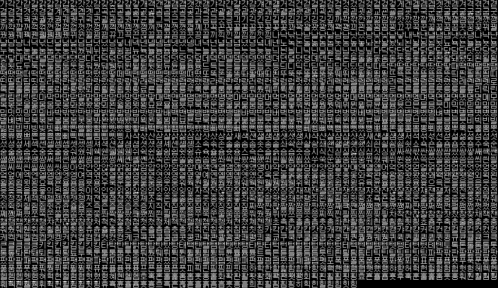

# 슈퍼로봇대전 컴플리트 박스 한글 글꼴 시험판

`v0.0.2-pre`는 게임 실행 파일에 내장된 일본어 글꼴을 갈무리14 기반 KS X 1001 한글 2,350자로 바꾸는 **표시 경로 확인용 시험판**입니다. 일본어 메시지의 한자가 임의의 한글로 보이면 내장 글꼴 교체 경로가 정상적으로 작동하는 것입니다.



## 확인된 글꼴 구조

게임은 BIOS KROM이 아니라 `SLPS_020.70`, `TR.WAR`, `EX.WAR`, `SECOND.WAR`, `THIRD.WAR`에 각각 들어 있는 동일한 글꼴을 사용합니다.

- 글꼴 크기: `0x16000`바이트
- 구성: 2,816자 × 32바이트
- 셀 형식: 16×16, 1bpp, 행당 2바이트, MSB 우선
- 원본 글꼴 SHA-256: `6d84a02c49592abc9b0a7d66d91b5aa132543090a2698ca45af001ad3aea3752`
- 문자 인코딩: Shift-JIS가 아닌 게임 전용 글리프 인덱스

첫 257개 기호·영문·가나를 보존하고, 전체폭으로 처리되는 인덱스 `0x101–0xA2E`에 한글 2,350자를 넣었습니다. 일본어 문장 번역과 메시지 재인코딩은 아직 포함하지 않습니다.

## xdelta 적용

정상 소유한 원본 Track 1과 별도로 구한 xdelta3 실행 파일이 필요합니다. 원본 BIN을 덮어쓰지 마십시오.

```text
입력 파일: Super Robot Taisen Complete Box (Track 1).bin
입력 크기: 565,543,104 bytes
입력 SHA-256: 3f25650b588774d55c3bbb5b771779beab408eaca020e9a622133ade323a0f94

출력 SHA-256: 4749e1c85c28999ae0abc0e9128cbe2b18d113c552f0e93aa2328e092cc317f6
```

저장소 루트에 `xdelta.exe`가 있을 때:

```powershell
.\apply_patch.ps1 `
  -SourceTrack1 ".\Super Robot Taisen Complete Box (Track 1).bin" `
  -SourceTrack2 ".\Super Robot Taisen Complete Box (Track 2).bin"
```

직접 적용하려면:

```powershell
.\xdelta.exe -d -s `
  ".\Super Robot Taisen Complete Box (Track 1).bin" `
  ".\release\srwcb-hangul-exe-font-test-v0.0.2-pre.xdelta" `
  ".\Super Robot Taisen Complete Box Hangul Font Test (Track 1).bin"
```

Track 2는 수정하지 않습니다. 동봉된 PowerShell 스크립트에 Track 2를 지정하면 출력 Track 1과 원본 Track 2를 연결하는 CUE도 생성합니다.

## 시험할 내용

- 게임의 메뉴·대화에서 기존 한자가 한글 음절로 바뀌는지 확인합니다.
- 가나, 영문, 숫자와 기호는 그대로 보여야 합니다.
- 갈무리14는 16×16 셀 안에 14×14로 배치했습니다. 글자가 너무 크거나 세로 위치가 어색하면 다음 판에서 12픽셀급으로 조정합니다.
- 에뮬레이터별 확인은 아직 완료하지 않았습니다.

## 재현

```powershell
python -m pip install -r requirements.txt

python .\tools\build_exe_hangul_font.py `
  .\font\Galmuri14.bdf `
  .\extracted `
  .\test_build\exe_font_test

python .\tools\patch_raw_track_exes.py `
  ".\Super Robot Taisen Complete Box (Track 1).bin" `
  ".\Super Robot Taisen Complete Box Hangul Font Test (Track 1).bin" `
  .\extracted `
  .\test_build\exe_font_test\extracted
```

저장소에는 게임 실행 파일, 게임 ROM, BIOS, 에뮬레이터, xdelta 실행 파일을 포함하지 않습니다. 자세한 분석 주소는 [조사 기록](docs/RESEARCH.md), 라이선스와 권리 고지는 [NOTICE](NOTICE.md)를 확인하십시오.
